## 요구사항

### 기본

- [ ] 기본 항목 1
- [ ] 기본 항목 2

### 심화

- [ ] 심화 항목 1
- [ ] 심화 항목 2

## 주요 변경사항

- 기존의 Base코드 RestfulAPI로 변경
    - UserController와 MessageController에 Multipart로 되어있어 postman에서 POST 요청시 기존의 raw 형식으로
      application/json으로 요청하지 않고 form-data형식으로 요청하였습니다.
    - Multipart부분에서 required = false이므로 파일은 따로 추가하지 않앗습니다.
    - Multipart부분인 @RequestPart부분을 잘 모르겠습니다.

## 스크린샷

-

## 기본 요구사항 결과 사진

- ### User
    - create
      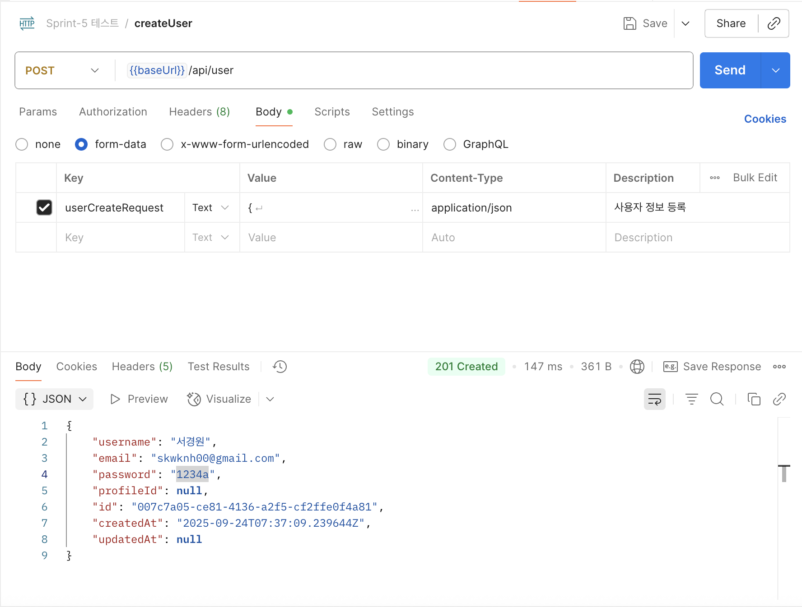
    - findAll
      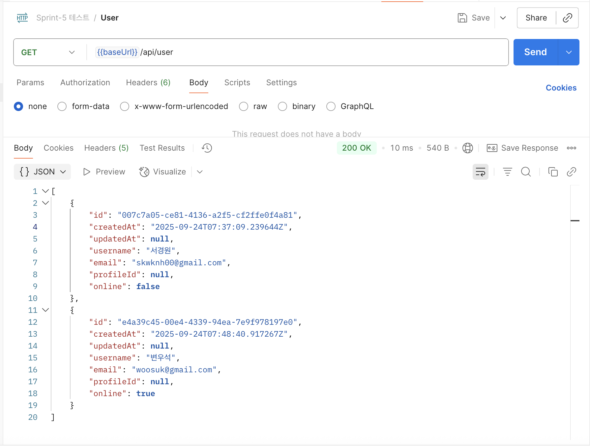
    - update
      
    - 수정 후 전체 조회
      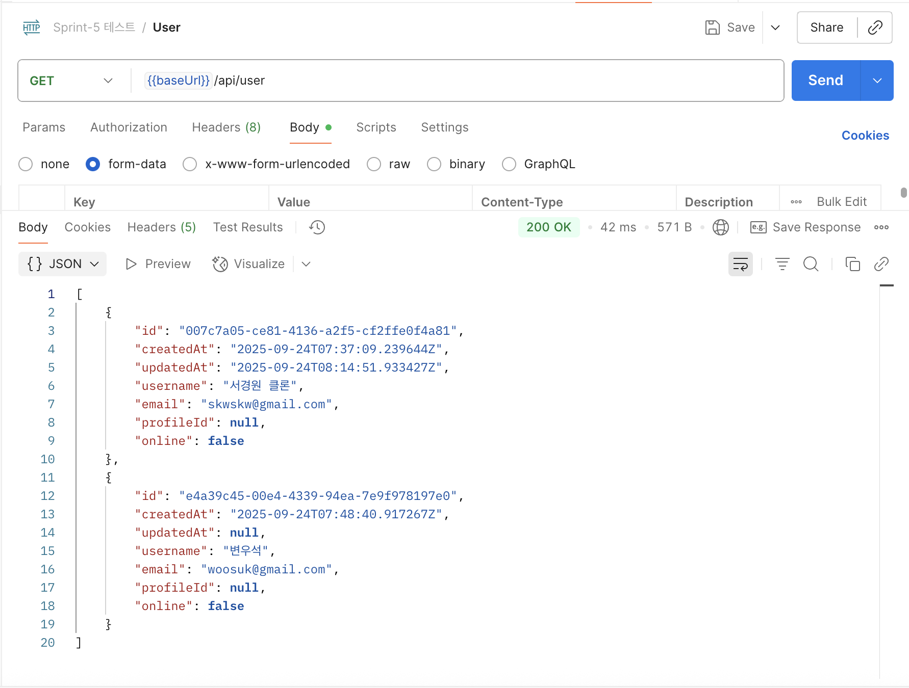
    - delete
      
    - 삭제 후 조회
      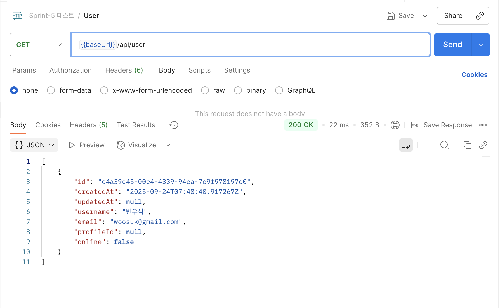
    - 로그인 성공
      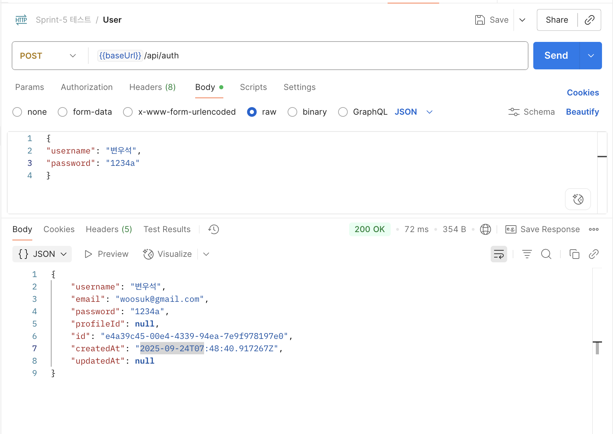
    - 마지막 활동시간이 5분 이상 경과 한 시간을 입력시 사용자 상태 false
      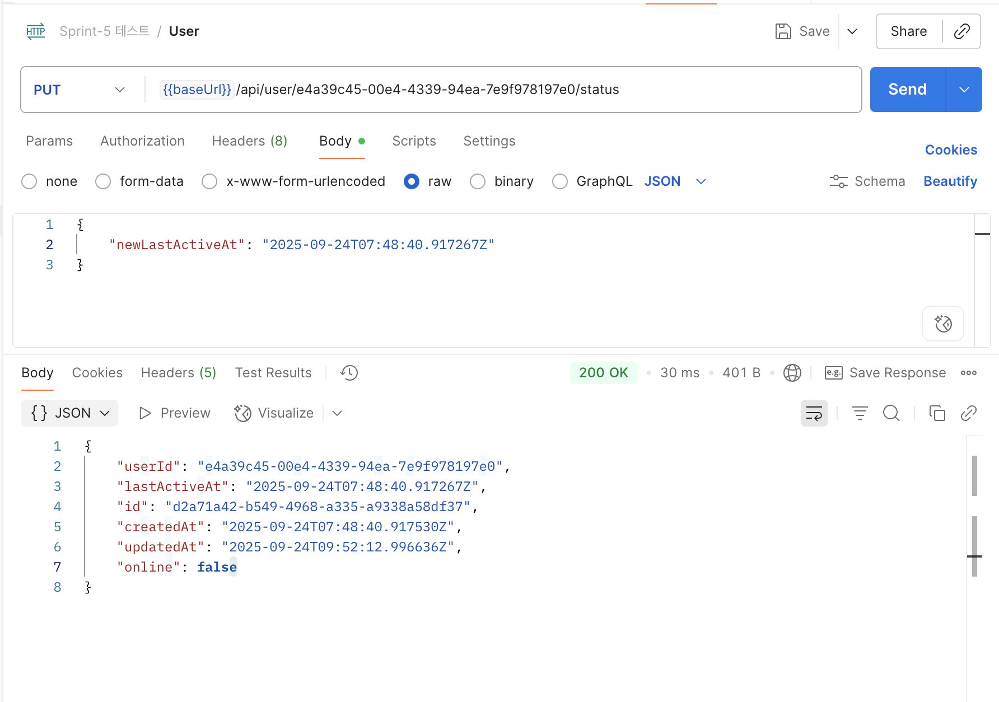
    - 마지막 활동시간이 5분이상 지나지 않았을 때
    - 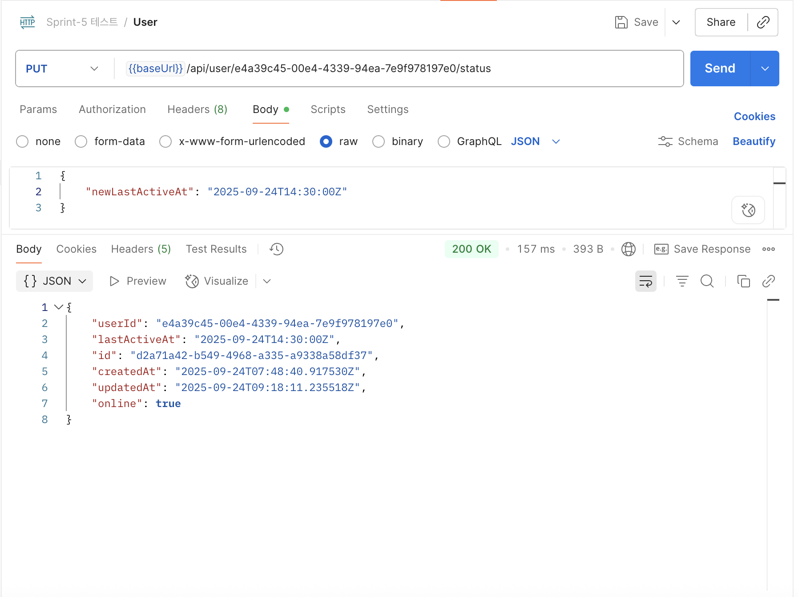
- ### Channel
    - 공용 채널 생성: 사용자 접속 여부와 관계없이 생성이 가능한것을 확인했습니다.
      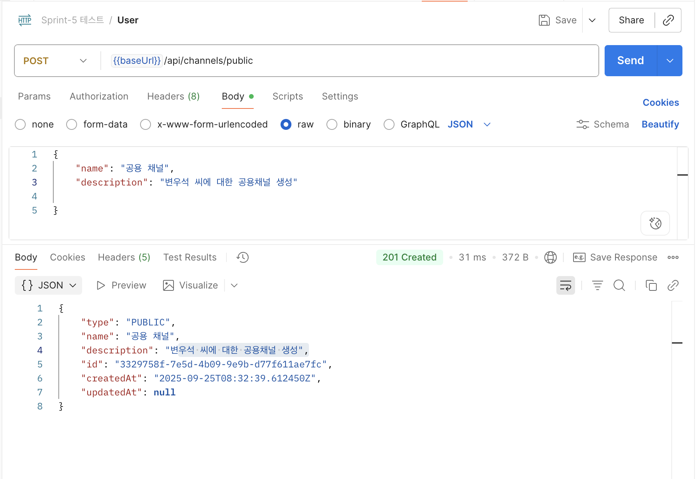
    - 변우석 ID로 개인채널 생성
    - 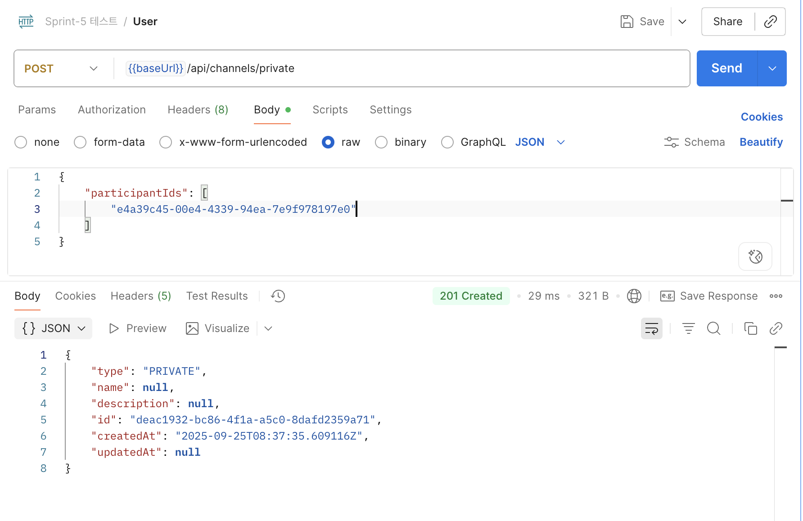
    - 전체 체널 조회
        - 쿼리 파라미터에 사용자 ID입력하였을때 개인채널 + 공용채널 둘다 나옴
        - 개인 채널은 참여자에 사용자ID입력되있고, 공용은 그렇지 않고 다나 오는것 같음

      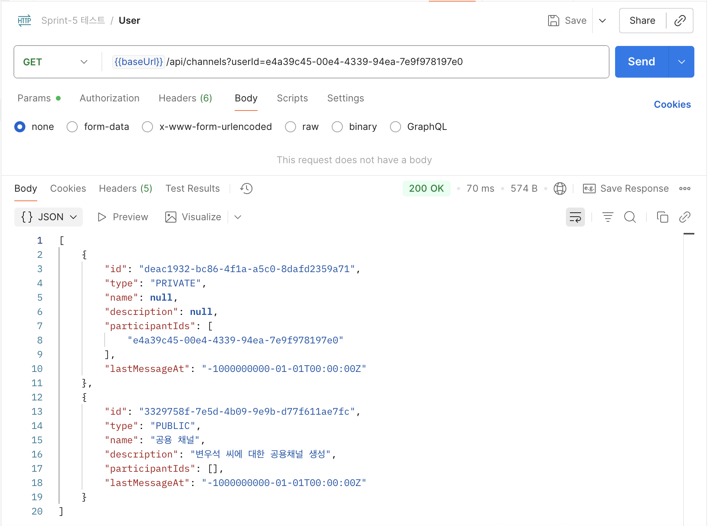
    - ### Message
        - 특정 채널과, 작성자 아이디에 따른 메시지 생성
          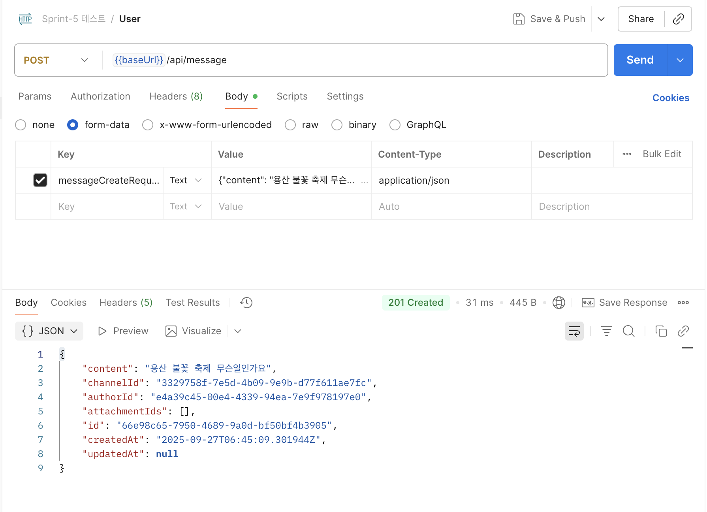
        - 메시지 ID에 따른 메시지 수정 기능
          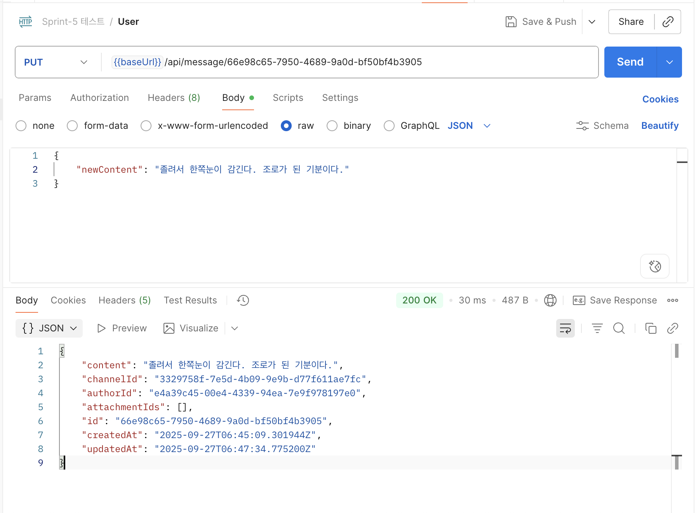
        - 채널 아이디에 해당하는 메시지 조회
          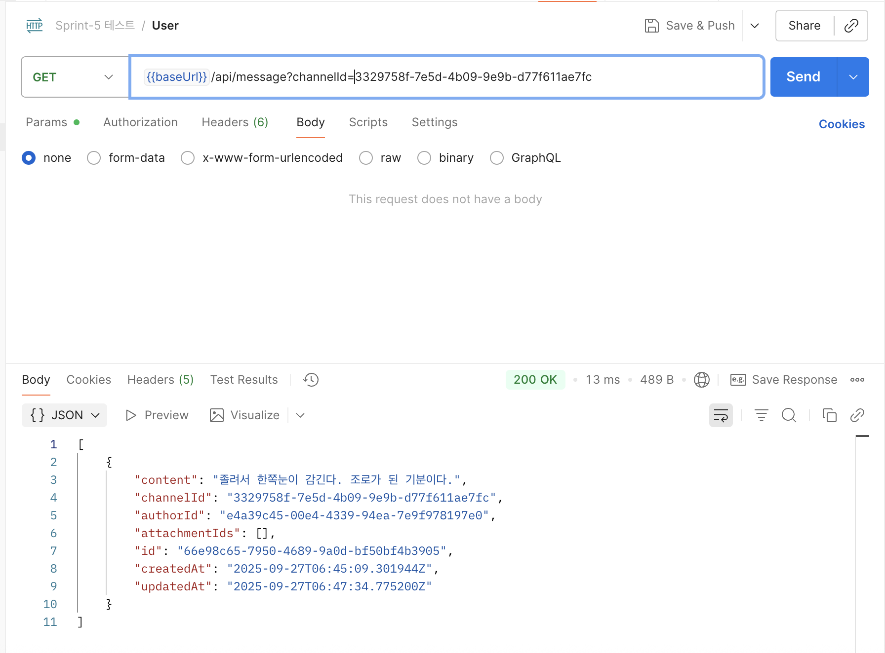
    - attachmentIds는 파일(부착물)을 따로 추가 안하였기에 비어있음
- ### BinaryContent:  파일들 수정에 따른 생략
- ### Sweagger 기반 API 문서 생성
  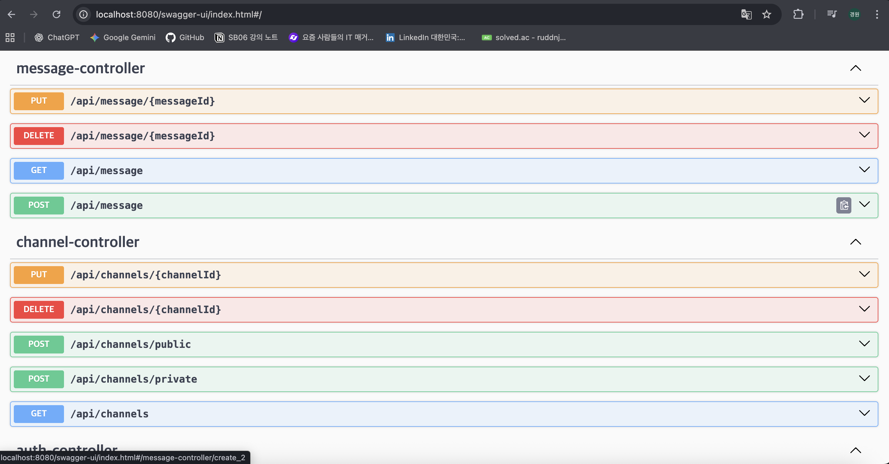

## 멘토에게

- 임의로 판매자 정보를 등록하때 비밀번호를 까먹어 확인하기 위해 password도 보이도록 설정하였습니다.
- 

