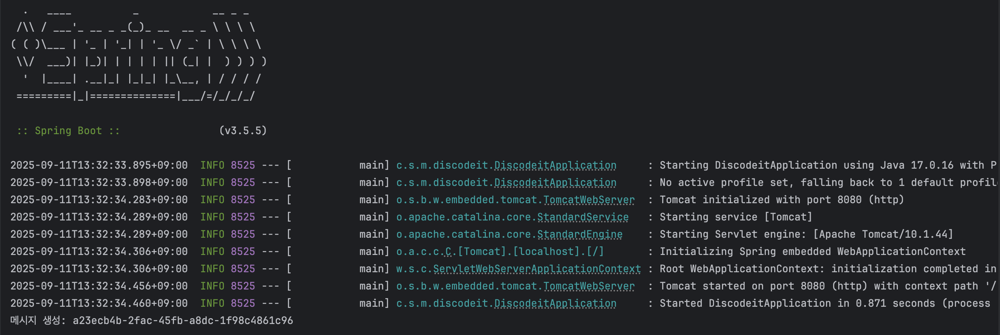
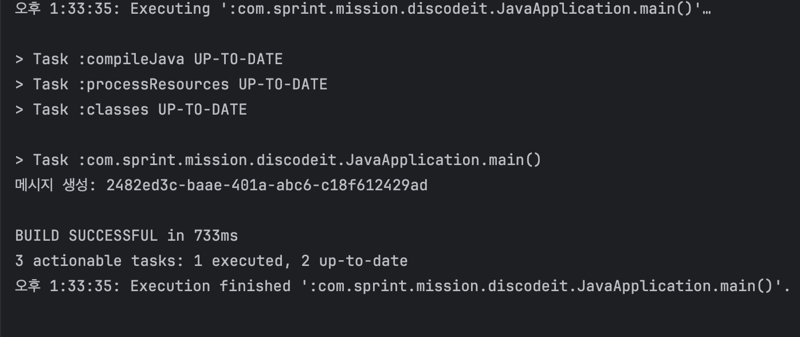

## 요구사항

### 기본
- [ ] 기본 항목 1
- [ ] 기본 항목 2

### 심화
- [ ] 심화 항목 1
- [ ] 심화 항목 2

## [ ] JavaApplication과 DiscodeitApplication에서 Service를 초기화하는 방식의 차이에 대해 다음의 키워드를 중심으로 정리해보세요. 

- JavaApplication
  - 개발자가 직접 객체를 생성하고 연결하기에 IoC Container 없음
  - new BasicUserService(userRepository); 처럼 의존성을 직접 생성자에 주입함
  - 단순한 POJO임, 스프링 컨테이너가 없어 Bean 개념 존재하지 않음
  
- DiscodeitApplication
  - IoC 컨테이너인 ApplicationContext를 사용함 
  - context.getBean(.class) 호출시 스프링이 관리하는 Bean반환
  - @Reposiotry 와 @Service를 사용하여 빈 등록

## 주요 변경사항
기본요구사항 변경 사항
- 베이스 코드는 모범답안으로 올라온 코드를 바탕으로 진행하였습니다.
- .gitignore에 직전에 피드백 주신 보안 사항들 업데이트
- @Repository, @Service를 사용하여 Beam등록
  - 따로 별도 설정 클래스 @Cofiguration를 만들어 Bean을 등록할까 고민은 했음
- lombok을 사용하여 Getter부분을 @Getter 어노테이션으로 대체
- @RequiredArgsConstructor를 사용하여 자동으로 Basic*Serviced의 생성자를 만듬

추가 기능 요구사항 변경 사항
- Long타입의 시간을 Instant 타입으로 변경 
- UserStatus, ReadStatus, BinaryContent 도메인 추가
- UserStatus
  - userId참조
  - 현재 접속중인지 여부 recentOnline을 Instant.now()로 현재시간 동기화
  - isAfter을 사용하여 현재시간과 recentOnline의 차가 5분이상 나는지 확인
- ReadStatus
  - userId와 channelId 참조
  - 현재 읽은시간 = 현재 시간으로 동기화
  - 읽은지 안읽은지 여부 isBefore과 isAfter 사용해 최근에 읽은것 확인
- BinaryContent
  - 불변이기에 final로 필드 선언
- User.java
  - profileImg 추가 -> 사진은 URL이므로 STRING으로 받아올것 같음
- Message.java
  - List<UUID> attachmentIds 추가하여 어떤 사진, 파일등이 저장됬는지
- UserStatusRepository, ReadStatusRepository, BinaryContentRepository 생성
- 

## 스크린샷

기본 요구사항 결과 사진
* DiscodeitApplicaton

* JavaApplication

## 멘토에게
- 셀프 코드 리뷰를 통해 질문 이어가겠습니다.

