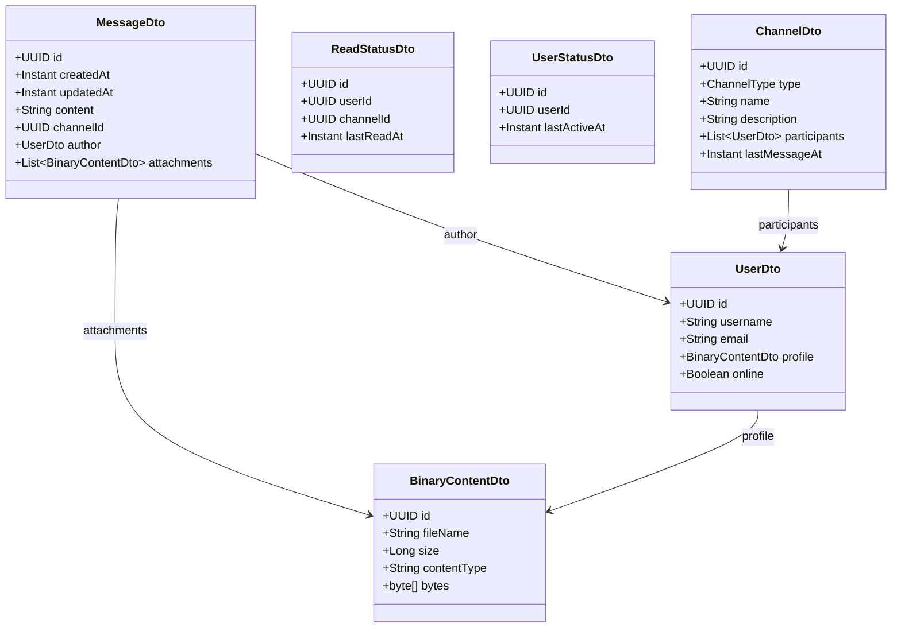

# 기본 요구사항

## 데이터베이스

- [x] 아래와 같이 데이터베이스 환경을 설정하세요.
    - 데이터베이스: discodeit
    - 유저: discodeit_user
    - 패스워드: discodeit1234
- [x] ERD를 참고하여 DDL을 작성하고, 테이블을 생성하세요.
    - 작성한 DDL 파일은 /src/main/resources/schema.sql 경로에 포함하세요.
    -
    - PK: Primary Key
    - UK: Unique Key
    - NN: Not Null
    - FK: Foreign Key
    - ON DELETE CASCADE: 연관 엔티티 삭제 시 같이 삭제
    - ON DELETE SET NULL: 연관 엔티티 삭제 시 NULL로 변경

## Spring Data JPA 적용하기

- [x] Spring Data JPA와 PostgreSQL을 위한 의존성을 추가하세요.
- [x] 앞서 구성한 데이터베이스에 연결하기 위한 설정값을 application.yaml 파일에 작성하세요.
- [x] 디버깅을 위해 SQL 로그와 관련된 설정값을 application.yaml 파일에 작성하세요.

## 엔티티 정의하기

- [x]  클래스 다이어그램을 참고해 도메인 모델의 공통 속성을 추상 클래스로 정의하고 상속 관계를 구현하세요.
    - 이때 Serializable 인터페이스는 제외합니다.
    - 패키지명: com.sprint.mission.discodeit.entity.base
    - 클래스 다이어그램

  ```mermaid
      classDiagram
    class BaseEntity {
        <<abstract>>
        UUID id
        Instant createdAt
    }

    class BaseUpdatableEntity {
        <<abstract>>
        Instant updatedAt
    }

    class BinaryContent {
    }

    class Channel {
    }

    class Message {
    }

    class User {
    }

    class ReadStatus {
    }

    class UserStatus {
    }

    BaseEntity <|-- BaseUpdatableEntity
    BaseEntity <|-- BinaryContent
    BaseUpdatableEntity <|-- Channel
    BaseUpdatableEntity <|-- Message
    BaseUpdatableEntity <|-- User
    BaseUpdatableEntity <|-- ReadStatus
    BaseUpdatableEntity <|-- UserStatus
```

- [x]  JPA의 어노테이션을 활용해 createdAt, updatedAt 속성이 자동으로 설정되도록 구현하세요.
    - @CreatedDate, @LastModifiedDate
- [x]  클래스 다이어그램을 참고해 클래스 참조 관계를 수정하세요. 필요한 경우 생성자, update 메소드를 수정할 수 있습니다. 단, 아직 JPA Entity와 관련된 어노테이션은 작성하지 마세요.
    - 클래스 다이어그램

  ```mermaid
classDiagram
    class ReadStatus {
        User user
        Channel channel
        Instant lastReadAt
    }

    class Message {
        String content
        Channel channel
        User author
        List~BinaryContent~ attachments
    }

    class User {
        String username
        String email
        String password
        BinaryContent profile
        UserStatus status
    }

    class Channel {
        ChannelType type
        String name
        String description
    }

    class UserStatus {
        User user
        Instant lastActiveAt
    }

    class BinaryContent {
        String fileName
        Long size
        String contentType
        byte[] bytes
    }

    ReadStatus "*" --> "1" User
    User "1" <--> "1" UserStatus
    User "1" --> "0..1" BinaryContent: profile
    ReadStatus "1" --> "*" Channel
    Message "*" --> "1" User: author
    Message "1" --> "*" Channel
    Message "1" --> "*" BinaryContent: attachments
  ```

    - 화살표의 방향과 화살표 유무에 유의하세요.

- [x]  ERD와 클래스 다이어그램을 토대로 연관관계 매핑 정보를 표로 정리해보세요.(이 내용은 PR에 첨부해주세요.)
- [x] JPA 주요 어노테이션을 활용해 ERD, 연관관계 매핑 정보를 도메인 모델에 반영해보세요.
    - @Entity, @Table
    - @Column, @Enumerated
    - @OneToMany, @OneToOne, @ManyToOne
    - @JoinColumn, @JoinTable
- [x] ERD의 외래키 제약 조건과 연관관계 매핑 정보의 부모-자식 관계를 고려해 영속성 전이와 고아 객체를 정의하세요.
    - cascade, orphanRemoval

### 레포지토리와 서비스에 JPA 도입하기

- [x] 기존의 Repository 인터페이스를 JPARepository로 정의하고 쿼리메소드로 대체하세요.
    - FileRepository와 JCFRepository 구현체는 삭제합니다.
- [x] 영속성 컨텍스트의 특징에 맞추어 서비스 레이어를 수정해보세요.
    - 힌트: 트랜잭션, 영속성 전이, 변경 감지, 지연로딩
        - Entity와 API의 결합
        - 프로덕션 환경에서는 성능을 고려해 OSIV를 false로 설정하는 경우가 대부분
        - 양방향 연관관계 시 순환 참조
        - 민감한 데이터
- [x] 다음의 클래스 다이어그램을 참고하여 DTO를 정의하세요.



-[x]  Entity를 DTO로 매핑하는 로직을 책임지는 Mapper 컴포넌트를 정의해 반복되는 코드를 줄여보세요.
    - 패키지명: com.sprint.mission.discodeit.mapper

  ```mermaid

classDiagram
    class ChannelMapper {
        -MessageRepository messageRepository
        -ReadStatusRepository readStatusRepository
        -UserMapper userMapper
        +ChannelDto toDto(Channel)
    }
    class MessageMapper {
        -BinaryContentMapper binaryContentMapper
        -UserMapper userMapper
        +MessageDto toDto(Message)
    }
    class ReadStatusMapper {
        +ReadStatusDto toDto(ReadStatus)
    }
    class UserStatusMapper {
        +UserStatusDto toDto(UserStatus)
    }
    class UserMapper {
        -BinaryContentMapper binaryContentMapper
        +UserDto toDto(User)
    }
    class BinaryContentMapper {
        +BinaryContentDto toDto(BinaryContent)
    }

    ChannelMapper --> UserMapper: "uses"
    ChannelMapper --> BinaryContentMapper: "uses"
    MessageMapper --> UserMapper: "uses"
    UserMapper --> BinaryContentMapper: "uses"

```

## BinaryContent 저장 로직 고도화

데이터베이스에 이미지와 같은 파일을 저장하면 성능 상 불리한 점이 많습니다. 따라서 실제 바이너리 데이터는 별도의 공간에 저장하고, 데이터베이스에는 바이너리 데이터에 대한 메타 정보(파일명, 크기, 유형 등)만
저장하는 것이 좋습니다.

- [x]  BinaryContent 엔티티는 파일의 메타 정보(fileName, size, contentType)만 표현하도록 bytes 속성을 제거하세요.

- [x]  BinaryContent의 byte[] 데이터 저장을 담당하는 인터페이스를 설계하세요.

> 저장 매체의 확장성(로컬 저장소, 원격 저장소)을 고려해 인터페이스부터 설계합니다.

- 패키지명: com.sprint.mission.discodeit.storage
    - 클래스 다이어그램

      ```mermaid
  
        classDiagram
                class BinaryContentStorage {
                <<interface>>
                UUID put(UUID, byte[])
                InputStream get(UUID)
                ResponseEntity<?> download(BinaryContentDto)
                }
        ```

- BinaryContentStorage
    - 바이너리 데이터의 저장/로드를 담당하는 컴포넌트입니다.
    - UUID put(UUID, byte[])
        - UUID 키 정보를 바탕으로 byte[] 데이터를 저장합니다.
        - UUID는 BinaryContent의 Id 입니다.
    - InputStream get(UUID)
        - 키 정보를 바탕으로 byte[] 데이터를 읽어 InputStream 타입으로 반환합니다.
        - UUID는 BinaryContent의 Id 입니다.
    - ResponseEntity<?> download(BinaryContentDto)
        - HTTP API로 다운로드 기능을 제공합니다.
        - BinaryContentDto 정보를 바탕으로 파일을 다운로드할 수 있는 응답을 반환합니다.
- [x]  서비스 레이어에서 기존에 BinaryContent를 저장하던 로직을 BinaryContentStorage를 활용하도록 리팩토링하세요.

- [x]  BinaryContentController에 파일을 다운로드하는 API를 추가하고, BinaryContentStorage에 로직을 위임하세요.
- 엔드포인트: GET /api/binaryContents/{binaryContentId}/download
    - 요청
        - 값: BinaryContentId
        - 방식: Query Parameter
        - 응답: ResponseEntity<?>
    - 클래스 다이어그램
  ```mermaid

    classDiagram
    class BinaryContentController {
    }
    class UserService {
    }
    class MessageService {
    }
    class BinaryContentService {
    }
    class BinaryContentStorage {
    }
    class BinaryContentRepository {
    }
  
    BinaryContentController --> BinaryContentService : "uses"
    BinaryContentController --> BinaryContentStorage : "uses"
  
    UserService --> BinaryContentStorage : "uses"
    UserService -- BinaryContentRepository : "uses"
  
    MessageService --> BinaryContentStorage : "uses"
    MessageService --> BinaryContentRepository : "uses"
    
    BinaryContentService --> BinaryContentStorage : "uses"
    BinaryContentService --> BinaryContentRepository : "uses"
    

  ```

- [x]  로컬 디스크 저장 방식으로 BinaryContentStorage 구현체를 구현하세요.
- 클래스 다이어그램
  ```mermaid
    classDiagram
    class BinaryContentStorage {
    <<interface>>
    +UUID put(UUID, byte[])
    +InputStream get(UUID)
    +ResponseEntity~T~ download(BinaryContentDto)
    }
  
    class LocalBinaryContentStorage {
    -Path root
    +LocalBinaryContentStorage(Path)
    +init()
    +UUID put(UUID, byte[])
    +InputStream get(UUID)
    +ResponseEntity~Resource~ download(BinaryContentDto)
    -Path resolvePath(UUID)
    }
  
    BinaryContentStorage <|.. LocalBinaryContentStorage : implements
  ```
- [x] discodeit.storage.type 값이 local 인 경우에만 Bean으로 등록되어야 합니다.

    - Path root
        - 로컬 디스크의 루트 경로입니다.
        - discodeit.storage.local.root-path 설정값을 정의하고, 이 값을 통해 주입합니다.
    - void init()
        - 루트 디렉토리를 초기화합니다.
        - Bean이 생성되면 자동으로 호출되도록 합니다.
    - Path resolvePath(UUID)
        - 파일의 실제 저장 위치에 대한 규칙을 정의합니다.
            - 파일 저장 위치 규칙 예시: {root}/{UUID}
        - put, get 메소드에서 호출해 일관된 파일 경로 규칙을 유지합니다.
    - ResponseEntity<Resource> donwload(BinaryContentDto)
        - get 메소드를 통해 파일의 바이너리 데이터를 조회합니다.
        - BinaryContentDto와 바이너리 데이터를 활용해 ResponseEntity<Resource> 응답을 생성 후 반환합니다.

## 페이징과 정렬

- [x] 메시지 목록을 조회할 때 다음의 조건에 따라 페이지네이션 처리를 해보세요.
    - 50개씩 최근 메시지 순으로 조회합니다.
    - 총 메시지가 몇개인지 알 필요는 없습니다.
- [x] 일관된 페이지네이션 응답을 위해 제네릭을 활용해 DTO로 구현하세요.
    - 패키지명: com.sprint.mission.discodeit.dto.response
    - 클래스 다이어그램
  ```mermaid
    classDiagram
    class PageResponse~T~{
    +List~T~ content
    +int number
    +int size
    +boolean hasNext
    +Long totalElements
    }
  ```
    - content: 실제 데이터입니다.

    - number: 페이지 번호입니다.

    - size: 페이지의 크기입니다.

    - totalElements: T 데이터의 총 갯수를 의미하며, null일 수 있습니다.

- [x] Slice 또는 Page 객체로부터 DTO를 생성하는 Mapper를 구현하세요.
    - 패키지명: com.sprint.mission.discodeit.mapper
  ```mermaid
    classDiagram
  class PageResponseMapper{
  +PageResponse~T~ fromSlice(Slice~T~)
  +PageRseponse~T~ fromPage(Page~T~)
  }
  ```
    - 확장성을 위해 제네릭 메소드로 구현하세요.

# 심화 요구사항

## N+1 문제

- [x] N+1 문제가 발생하는 쿼리를 찾고 해결해보세요.

## 읽기전용 트랜잭션 활용

- [x] 프로덕션 환경에서는 OSIV를 비활성화하는 경우가 많습니다. 이때 서비스 레이어의 조회 메소드에서 발생할 수 있는 문제를 식별하고, 읽기 전용 트랜잭션을 활용해 문제를 해결해보세요.
    - OSIV 비활성화하기

          spring:
            jpa:
              open-in-view: false

## 페이지네이션 최적화

- [x] 오프셋 페이지네이션과 커서 페이지네이션 방식의 차이에 대해 정리해보세요.

> 이 내용은 PR에 첨부해주세요.

- [x] 기존에 구현한 오프셋 페이지네이션을 커서 페이지네이션으로 리팩토링하세요.
    - PageResponse는 다음과 같이 변경하세요.
  ```mermaid
    classDiagram
    class PageResponseMapper{
    +PageResponse~T~ fromSlice(Slice~T~)
    +PageRseponse~T~ fromPage(Page~T~)
    }
  ```
- 다음의 API 명세를 준수하세요.
  - API 스펙 v1.2
- API 스펙을 준수한다면, 아래의 프론트엔드 코드와 호환됩니다.
  - 정적 리소스 v1.2.4
  - 소스 코드(참고용) v1.2.4
>프론트엔드 소스 코드는 참고용으로만 활용하세요. 수정하여 활용하는 경우 이어지는 요구사항 또는 미션을 수행하는 데 어려움이 있을 수 있습니다.
## MapStruct 적용
 - [x] Entity와 DTO를 매핑하는 보일러플레이트 코드를 MapStruct 라이브러리를 활용해 간소화해보세요.